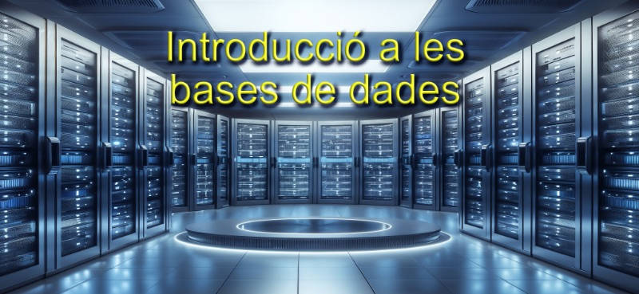
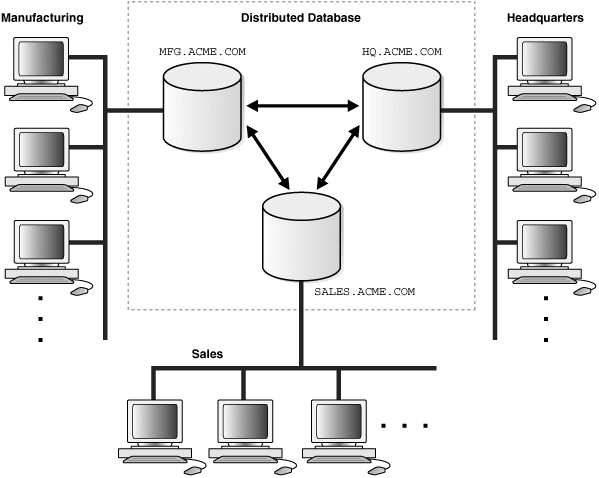

# UA 1 - NF1: Introducció a les bases de dades

* Les dades són les propietats o valors aïllats de qualsevol element.
    * A les propietats de les dades les anomenem, metadades.
* La informació, és l'estructuració, relació i ordenació d'aquestes dades.
* Una base de dades, és una col·lecció de dades organitzada amb una estructurada comú i accessible.

Dos personatges fonamentals en la història de les bbdd relacionals

Model Entidad/Relació o E/R model

**Peter Chen: Desenvolupador del model conceptual al 1978**

[Chen](https://www.csc.lsu.edu/~chen/)

Entity Relationship Modelling: The absolute Basics:

??? note "Veure vídeo"
    <iframe width="560" height="315" src="https://www.youtube-nocookie.com/embed/1Ved3u0CpPo?si=7sBV3GLPk09i351K" title="YouTube video player" frameborder="0" allow="accelerometer; autoplay; clipboard-write; encrypted-media; gyroscope; picture-in-picture; web-share" referrerpolicy="strict-origin-when-cross-origin" allowfullscreen></iframe>

**Model Relacional**

Edgar Frank Codd (Ted Codd): Matemàtic que va desenvolupar el model relacional de dades quan treballava a IBM als anys '70

??? note "Veure vídeo"
    <iframe width="560" height="315" src="https://www.youtube-nocookie.com/embed/KG-mqHoXOXY?si=58n1zToA8w2qCQU5" title="YouTube video player" frameborder="0" allow="accelerometer; autoplay; clipboard-write; encrypted-media; gyroscope; picture-in-picture; web-share" referrerpolicy="strict-origin-when-cross-origin" allowfullscreen></iframe>

## Les dades i les bases de dades

La realitat, la seva conceptualització i la seva representació informàtica són tres mons diferenciats:

* El món real. Està constituït pels objectes (materials o no)de la realitat que ens interessen i amb els quals haurem de treballar.
* El món conceptual. Conjunt de coneixements o informacions obtinguts gràcies a l'observació de la part del món real que ens interessa. Un mateix món conceptual pot donar lloc a diferents mons conceptuals, en funció de la manera de percebre la realitat o els interessos de l'observador d'aquesta.
* El món de les representacions. Està format per les representacions informàtiques, o dades, del món conceptual,necessàries per treballar.

## Les dades i la seva representació

Fases per a la conversió de les concepcions en dades:

1. Fase de disseny lògic. Es treballa amb el model abstracte de dades obtingut al final de l'etapa de disseny conceptual, per traduir-lo al model de dades utilitzat pel sistema gestor de bases de dades (SGBD) amb el qual es vol implementar i mantenir la futura base de dades (BD).
  * Un cop realitzat el model conceptual (model E/R) farem la transformació al model relacional (model lògic) aplicant les regles de transformació
2. Fase de disseny físic. Es poden fer certes modificacions sobre l'esquema lògic obtingut en la fase de disseny anterior, per tal d'incrementar l'eficiència en algunes operacions que s'hagin de fer amb les dades.
  * Quan disposem del model relacional haurem de normalitzar la base de dades y un cop normalitzada (utilització de formes normals FN) es procedirà a la seva implementació amb el llenguatge SQL.

## La informació

És la interpretació que es fa de les dades. Les informacions es caracteritzen, fonamentalment, per tres elements: entitats, atributs i valors.

* Les entitats són els objectes del món real que conceptualitzem. Són identificables, és a dir, distingibles els uns dels altres. I ens interessen algunes (com a mínim una) de les seves propietats (atributs). Exemple: Entitat “Cotxe”
* Els atributs són les propietats que ens interessen de les entitats. Exemple: Atribut 'Color'
* Els valors són els continguts concrets dels atributs, les determinacions concretes que assoleixen. Exemple: Valor: 'Vermell'.

A més dels tres elements bàsics que caracteritzen la informació(és a dir, entitats, atributs i valors), cal tenir en compte el factor cronològic.

**Entitat tipus**: es tracta d'un tipus genèric d'entitat o, si es prefereix, d'una abstracció, que fa referència a una classe de coses com, per exemple, els cotxes en general.

**Entitat instància**: es refereix a la conceptualització d'un objecte concret del món real, com ara un cotxe concret, distingible dels altres objectes del mateix tipus, gràcies a alguna propietat(com podria ser el valor de l'atribut Matricula).

Anomenem **domini** tot el conjunt de valors que un atribut determinat pot prendre vàlidament.

Un **tipus de dada** defineix un conjunt de valors amb unes característiques comunes que els fan compatibles entre ells, per la qual cosa també defineix una sèrie d'operacions admissibles sobre aquests valors.

L'expressió **valor nul** indica l'absència de qualsevol valor associat a un determinat atribut d'una entitat instància concreta.

Un **atribut identificador** és el que permet distingir inequívocament cada entitat instància de la resta, perquè el seu valor és únic i no es repeteix en diferents entitats instància.Tot atribut o conjunt d'atributs que permeten identificar inequívocament entre ells les instàncies d'una entitat s'anomenen claus.

La representació més freqüent en l'àmbit informàtic de les BD és l'anomenada representació tabular (o, el que és el mateix, en forma de taula).

Cada taula representa una entitat genèrica, i està estructurada enfiles (agrupacions horitzontals de cel·les) i columnes (agrupacions verticals de cel·les):

* Cada fila representa una entitat instància (registre).
* Cada columna representa un atribut (camp).
* Cada cel·la (és a dir, cada intersecció d'una fila i d'una columna) emmagatzema el valor que tingui l'atribut de l'entitat instància de què es tracti.
* S'entén per fitxer la implementació informàtica d'una taula, amb les dades estructurades en registres i camps.
* La implementació de cada entitat instància s'anomena registre, i equival a una fila de la representació tabular.
* La implementació de cada atribut s'anomena camp, i equival a una columna de la representació tabular.
* Cada intersecció d'un registre i d'un camp emmagatzema el valor que tingui el camp del registre de què es tracti.
* Les interrelacions són informacions que permeten associar les entitats entre elles.
* Una BBDD consisteix en un conjunt de fitxers de dades interrelacionats.

## Tipus d'accés a les dades

En general,hi ha dues maneres bàsiques d'accedir a les dades:

**L'accés seqüencial** a un registre determinat, que implica l'accés previ a tots els registres anteriors.

**L'accés directe** a un registre concret, que implica l'obtenció directa del registre desitjat.

A més, hi ha una altra classificació habitual de **tipologies accessos**:

**L'accés per valor**, que permet l'obtenció del registre desitjat en funció del valor d'algun (o alguns) dels seus camps,sense considerar la posició que ocupa el registre.

**L'accés per posició**, que obre l'accés a un registre que ocupa una posició determinada, sense considerar el contingut del registre.

### Les quatre tipologies d'accés a dades més freqüents:

* SP (accés seqüencial per posició). Després d'haver accedit a un registre que es troba en una posició determinada, s'accedeix al registre que ocupa la posició immediatament posterior.
* DP (accés directe per posició). S'obté directament un registre pel fet d'ocupar una posició determinada.
* SV (accés seqüencial per valor). Després d'haver accedit a un registre que té un valor concret, s'accedeix al registre que ocupa la posició immediatament posterior, segons l'ordenació establerta a partir un camp determinat (o més). L'ordre serà creixent o decreixent, si es tracta d'un camp numèric, o alfabètic ascendent o descendent, si es tracta d'un camp de caràcters.
* DV (accés directe per valor). S'obté directament un registre pel fet de tenir un valor determinat en un dels seus atributs (o més).

## Organització per nivells

L'organització i enregistrament de les dades, i l'accés a aquestes es poden considerar des de dos punts de vista, més o menys propers a la implementació física de l'enregistrament de les dades:

**Nivell lògic**. Permet treballar amb les dades de manera més senzilla, independentment de la implementació física concreta, que no cal conèixer. És la manera de treballar més productiva i, pertant, la més recomanable, sempre que les circumstàncies no ens obliguen a fer optimitzacions a nivells més baixos.

**Nivell físic**. Implica un coneixement a baix nivell de la implementació física de l'organització de les dades i l'accés a aquestes.

## Fitxers i Bases de dades

Els fitxers tradicionals (i els programes necessaris per treballar-hi) s’han trobat amb serioses dificultats per satisfer les creixents necessitats dels usuaris en pràcticament tots els àmbits.

Per aquesta raó, les BBDD s’han anat implantant com a mecanisme per excel·lència d’emmagatzematge, processament i obtenció d’informació, tot desplaçant progressivament els fitxers de la seva posició preeminent anterior. La taula següent conté una breu descripció de les principals diferències entre els sistemes basats en fitxers tradicionals i les BBDD.

Característica     | Fitxers               | Bases de dades
------------------ | --------------------- | --------------------
Entitats tipus     | Les entitats instància d’un fitxer pertanyen a una sola entitat tipus.  | Les BD contenen entitats instància d’infinitat d’entitats tipus interrelacionades.
Interrelacions  | El sistema no interrelaciona fitxers.  | El sistema té previstes eines per interrelacionar fitxers.
Redundàncies    | És necessari crear fitxers a mida de cada aplicació, amb totes les dades necessàries, encara que estiguin repetides en altres fitxers. | Tècnicament, totes les aplicacions poden treballar amb la mateixa BD, la  qual cosa evita la redundància de dades i els riscos que comporta.
Inconsistències | És possible que els valors d’unes mateixes dades en diferents fitxers no coincideixin, si els programadors no les han actualitzat degudament. | Si les interrelacions estan ben dissenyades, les dades només han d’estar emmagatzemades en la BD un sol cop. Per tant, no hi ha risc d’inconsistències.
Obtenció de dades | Si no hi ha una aplicació que obtingui les dades que volem, o bé s’ha de fer un programa a mida, o bé s’ha d’aprofitar la sortida d’un programa amb objectius similars, i fer els càlculs necessaris manualment. | Permeten obtenir qualsevol conjunt de dades, segons les necessitats, dels del seu propi entorn de treball, sense haver d’escriure, compilar i executar cap nou programa d’aplicació contra la BD.
Aïllament de dades | Les dades estan disperses i aïllades en diferents arxius, la qual cosa dificulta el desenvolupament de les aplicacions. | Totes les dades són en la mateixa BD, interconnectades, la qual cosa en facilita l’obtenció.
Integritat de dades | Els programes han d’implementar totes les restriccions sobre les dades, afegint el codi font corresponent. El manteniment és complicat quan la informació es conté en diferents fitxers utilitzats per diferents aplicacions. | La BD s’encarrega directament d’implementar les restriccions sobre les  dades. Els programes no han d’incorporar codi font addicional per  garantir-les.
Atomicitat | Alguns conjunts d’operacions sobre les dades s’han d’executar de manera indivisible (o tots o cap), independentment de les fallades que el sistema pugui presentar (com ara per un tall de subministrament elèctric). Però això és molt difícil de garantir amb un sistema d’informació basat en fitxers. | Les BD incorporen la tècnica de les transaccions per tal de garantir fàcilment l’execució atòmica d’una pluralitat de processos sobre les dades.
Accés concurrent | L’actualització simultània de dades d’un mateix fitxer per part de diferents usuaris o aplicacions en pot provocar fàcilment la inconsistència. | Amb la tècnica del bloqueig, les BD garanteixen automàticament la  consistència de les dades, malgrat que més d’un usuari o més d’una aplicació les vulguin actualitzar simultàniament.
Seguretat | Habitualment, cada fitxer serveix per a un sol usuari o una sola aplicació (sobretot simultàniament), i ofereix una visió única del món real. Però no sempre tots els usuaris que utilitzen un fitxer haurien de tenir accés a totes les dades que conté. | Una BD pot ser compartida per molts usuaris de diferents tipus (fins i tot, simultàniament), els quals poden tenir diferents visions (vistes) del món real, en funció del seu perfil i dels permisos que s’hagin de concedir en cada cas.

Una BBDD és la representació informàtica dels conjunts d'entitats instància corresponent a diferents entitats tipus, i de les relacions entre aquestes. Aquest conjunt estructurat de dades ha de poder ser utilitzat de manera compartida i simultània per una pluralitat d'usuaris de diferents tipus.

S'utilitzen tres nivells d'abstracció (físic, lògic i de vistes) per amagar aquestes estructures complexes i simplificar, d'aquesta manera, la interacció dels usuaris amb el sistema.

## Arquitectura a 3 nivells

D’acord amb l’estàndard ANSI/X3/SPARC, hi hauria d’haver tres nivells d’esquemes:

* En el nivell extern se situen les diferents visions lògiques que els processos usuaris (programes d’aplicació i usuaris directes) tenen de les parts de la BD que utilitzen. Aquestes visions s’anomenen esquemes externs.
* En el nivell conceptual hi ha una sola descripció lògica bàsica, única i global, que anomenem esquema conceptual, i que serveix de referència per a la resta d’esquemes.
* En el nivell físic hi ha una única descripció física, que anomenem esquema intern.

{: style="transform: scale(0.5);"}

## Models de dades

Conjunts d’eines lògiques per descriure les dades, les seves interrelacions, el seu significat i les restriccionsa aplicar per tal de garantir-ne la coherència.

* **Estructures de dades**. Elements amb els quals es construeixen les BD, com ara taules, arbres, etc.
* **Regles d’integritat**. Restriccions que les dades hauran de respectar, com per exemple tipus de dada, dominis, claus, etc.
* **Operacions a realitzar amb les dades**. Altes, baixes, modificacions i consultes, com a mínim.

Els models de dades més utilitzats al llarg del temps han estat elssegüents, exposats per ordre cronològic d'aparició:

* [Jeràrquic](http://elies.rediris.es/elies9/4-2-1.htm)
* [En Xarxa](http://elies.rediris.es/elies9/4-2-2.htm)
* [Relacional](http://elies.rediris.es/elies9/4-2-3.htm)
* [Relacional amb objectes / orientat a objectes](https://docs.google.com/file/d/0B0dtHWxBWsYLVzUxYzBmbUxlUjA/edit?resourcekey=0-uzx91x4O80-oGiRRKfW1Ng)
* [Transaccionals](https://en.wikipedia.org/wiki/Database_transaction)  Recepció i enviament d'informació a gran velocitat
* [Documentals o no-sql](https://en.wikipedia.org/wiki/Document-oriented_database): Informació de gran quantitats de text o dades i el seu tractament. També s'anomenen bases de dades no relacionals.

> :bulb: [`Més informació`](http://www.aulaclic.es/sqlserver/b_1_1_4.htm)

> :bulb: [`Entenen les bases de dades jeràrquiques`](https://mariadb.com/kb/en/library/understanding-the-hierarchical-database-model/)

!!!note "Resum bases de dades jeràrquiques"
    La comprensió del model de base de dades jeràrquic és important per a qualsevol professional de la tecnologia. Aquest model és una estructura de dades organitzada en forma d’arbre, on cada node té un sol pare i diversos fills. Això significa que la informació s’organitza en nivells, com un organigrama. Aquest model és útil per a sistemes que requereixen una estructura rígida, com ara les aplicacions de gestió de dades.

    Un exemple d’aquesta estructura jeràrquica és un catàleg de llibres d’una biblioteca. El node pare seria la biblioteca, els fills serien les seccions de la biblioteca, com ara la secció d’infantil i la secció d’adults. A cada secció se li assignen fills, com ara la secció d’infantil que té llibres de ficció i no-ficció. Així, l’arbre es va omplint amb dades específiques.

    El model de base de dades jeràrquic té avantatges i desavantatges. Una avantatge és que és fàcil d’entendre i d’utilitzar. No obstant, també té limitacions, com ara la manca de flexibilitat. A més, a causa de la seva estructura rígida, no és adequat per a totes les aplicacions. En general, el model de base de dades jeràrquic és una opció viable per a sistemes amb estructures de dades clares i ben definides.

Les BD jeràrquiques emmagatzemen la informació en una estructura jeràrquica que podem imaginar amb una forma d'arbre invertit, oncada node pare pot tenir diferents fills.

El node superior, que no té pare, es coneix com a arrel. I els nodes que no tenen fills s'anomenen fulles.

{: style="transform: scale(0.5);"}

Una de les bbdd jeràrquiques amb més transcendència és la que va fer servir IBM (IMS) al projecte Apollo als anys seixanta.

Va servir per representar, sobretot, relacions de tipus 1:N

> :bulb: [`Entenen les bases de dades en xarxa`](https://mariadb.com/kb/en/library/understanding-the-network-database-model/)

!!!note "Resum bases de dades en xarxa"
    La comprensió del model de base de dades de xarxa és important per als professionals de les tecnologies de la informació, ja que aquest model és una forma alternativa d'organitzar i accedir a les dades en comparació amb altres models de base de dades. En aquest model, les dades es representen com a nodes i les relacions entre els nodes es defineixen per mitjà de punts i apuntadors. Això permet als usuaris accedir als registres relacionats directament sense haver de recórrer a través d’altres registres, com passa en altres models.

    El model de base de dades de xarxa va ser desenvolupat durant els anys 1960 i 1970, i va ser popular durant una dècada fins que va ser reemplaçat pel model de base de dades relacional. Tot i això, encara es fa servir en algunes aplicacions, especialment en les empreses i les aplicacions científiques. És important entendre que el model de base de dades de xarxa té les seves pròpies avantatges i desavantatges, i que no és adequat per a totes les aplicacions.

    En resum, el model de base de dades de xarxa és un model alternatiu per a l’organització i l'accés de les dades. Les dades es representen com a nodes i les relacions entre els nodes es defineixen per mitjà de punts i apuntadors. Tot i que va ser popular durant una dècada, el model de base de dades relacional va reemplaçar el model de xarxa. No obstant això, encara es fa servir en algunes aplicacions i és important entendre les seves avantatges i desavantatges.

Al començament del anys setanta, en el mercat, van anar sorgint BBDD que mantenien un model en xarxa (denominat CODASYL acrònim de **CO**nference on **DA**ta **SY**stem **L**anguages), semblant al model jeràrquic.

Estaven formades per registres interrelacionats mitjançant una estructura en forma d'arbre invertit, però més flexible, ja que permetia que els nodes tinguessin més d'un sol pare.

Servirà per representar relacions 1:N i N:M

{: style="transform: scale(0.5);"}

> :bulb: [`Entenen les bases de dades relacionals`](https://mariadb.com/kb/en/library/understanding-the-relational-database-model/)

El model de dades relacionals amb objectes és una extensió del model relacional en sentit estricte.

El model relacional es basa en la lògica de predicats i en la teoria de conjunts. Actualment, és el sistema més àmpliament utilitzat per modelitzar dades.

En els models de dades anteriors, les dades s'estructuraven gràcies a dos elements: els registres i les interrelacions, però el model relacional només consta d'un element: '*les relacions o taules*'.

{: style="transform: scale(0.5);"}

## Taula resumen de les diferents bases de dades

Tipus de BBDD              | Descripció               
-------------------------- | ------------------------------------
**Estàtica**               | Per a l’emmagatzematge i consulta de dades històriques o que no varien amb el temps. Per exemple, els registres de naixements, les estadístiques, els arxius, etc.
**Dinàmica**               | Per a l’emmagatzematge i modificació de dades que canvien amb el temps. Per exemple, els productes d’una botiga, les reserves d’un hotel, les dades personals d’uns clients, etc.
**Bibliogràfica**          | Per a l’emmagatzematge i consulta de dades sobre materials de lectura, com llibres, revistes, articles, etc. Per exemple, les biblioteques, les editorials, les bases de dades acadèmiques, etc.
**De text complet**        | Per a l’emmagatzematge i consulta de textos històrics o documentals que es consideren fonts primàries. Per exemple, els arxius nacionals, els diaris, les enciclopèdies, etc.
**Jeràrquica**             | Per a l’emmagatzematge i consulta de dades que tenen una relació de pare-fill o de superior-subordinat. Per exemple, les estructures organitzatives d’una empresa, els sistemes de fitxers d’un ordinador, els arbres genealògics, etc.
**Relacional**             | Per a l’emmagatzematge i consulta de dades que s’organitzen en taules amb files i columnes. Per exemple, les bases de dades SQL, com MySQL, Oracle, PostgreSQL, etc.
**De xarxa**                | Per a l’emmagatzematge i consulta de dades que s’organitzen en registres que es connecten entre si mitjançant enllaços. Per exemple, les bases de dades de xarxes socials, com Facebook, Twitter, LinkedIn, etc.
**Multidimensional**        | Per a l’emmagatzematge i consulta de dades que s’organitzen en dimensions o categories que permeten fer anàlisis complexes. Per exemple, les bases de dades de negoci, com OLAP, Data Warehouse, Data Mining, etc.
**Orientada a objectes**    | Per a l’emmagatzematge i consulta de dades que s’organitzen en objectes que tenen atributs i mètodes. Per exemple, les bases de dades de programació orientada a objectes, com Java, C++, Python, etc.
**Gràfica**                 | Per a l’emmagatzematge i consulta de dades que s’organitzen en nodes i arestes que tenen propietats i relacions. Per exemple, les bases de dades de grafos, com Neo4j, GraphDB, ArangoDB, etc.
**No relacional**           | Per a l’emmagatzematge i consulta de dades que no s’organitzen en taules i que s’adapten millor a les dades no estructurades o distribuïdes. Per exemple, les bases de dades NoSQL, com MongoDB, Cassandra, Redis, etc.
**Centralitzada**           | Per a l’emmagatzematge i consulta de dades que es troben en un sol servidor o dispositiu. Per exemple, les bases de dades locals, com SQLite, Access, FileMaker, etc.
**Distribuïda**             | Per a l’emmagatzematge i consulta de dades que es troben en diversos servidors o dispositius connectats entre si. Per exemple, les bases de dades en el núvol, com Google Cloud, Amazon Web Services, Microsoft Azure, etc.

## Tipus d'usuari a les bases de dades

A la base de dades es connecten múltiples perfils diferents d'usuaris:

* Administrador.
* Operador.
* Desenvolupador.
* Usuaris.

## L'usuari Administrador de la Base de dades

Algunes de les tasques de l'administrador d'una base de dades són:

* Instal·lació del sistema gestor de base de dades.
* Crear les estructures físiques inicials per a l'emmagatzematge de dades. Fitxers o espai on s'emmagatzemen les dades.
* Crear els objectes (taules, vistes, índexs) que el desenvolupadors han indicat que l'aplicació necessita.
* Crear usuaris i donar-los els permisos que necessiten.
* Controlar i monitoritzar el rendiment de la base de dades.
* Planificar els backups.
* Participar en el documents de seguretat que les lleis en vigor indiquin.

## Les bases de dades distribuïdes

Una base de dades distribuïda és aquella que s'està executant en diferents màquines independents de manera simultània i de forma transparent per als usuaris finals.

Optar per una base de dades distribuïda té els seus avantatges i inconvenients. Podríem destacar els següents:

### Avantatges que es poden assolir:

* Alta disponibilitat. Pot ser que un node caigui però la resta de nodes supleixen la seva
* absència.
* Alt rendiment. Els diferents nodes cooperen per tal d'executar les consultes en temps més
* curts.
* Fàcil creixement. Si cal més rendiment afegim nous nodes.

### Inconvenients que ens podem trobar:

* Complexitat d'administració: calen més habilitats per tal de manejar una base de dades distribuïda: seguretat, configuracions, etc.
* Complexitat de software: en cas que les transaccions estiguin suportades pel SGBD aquestes
* són molt més complexes de manegar.
* Seguretat: els nodes han d'estar connectats entre ells, cal fer-ho de forma segura per evitar
* intrusos.

### Components

Quan parlem de base de dades distribuïda apareixen nous conceptes i acrònims que cal saber:

* DDBMS: Distributed Database Management System.
* DTM: Distributed Transaction Manager. Encarregat de gestionar i coordinar transaccions entre les diferents màquines on està distribuït el nostre sistema gestor de base de dades. Cal recordar que les transaccions comencen i finalitzen, que durant la seva vida es fan canvis sobre les dades i que en finalitzar els canvis es confirmen o es desestimen.
* DBM: DataBase Manager.
* Node: Cadascuna de les màquines independents sobre les que s'està executant el DDBMS. De vegades es parla de cluster al conjunt de nodes que conformen el sistema.
* Maquinari: Per ser un sistema distribuït s'ha d'executar sobre màquines que no comparteixen components, és a dir, vàries màquines interconnectades per xarxa però sense compartir CPU ni memòria.
* Programari: cadascuna de les màquines sobre les que s'executa el sistema distribuït disposa del seu propi programari, com a mínim un sistema operatiu i el programari del DDBMS.

{: style="transform: scale(0.5);"}

## Teorema de CAP

En informàtica teòrica, el teorema CAP, també conegut com a teorema de Brewer, formula que és impossible garantir simultàniament les tres característiques següents en una aplicació distribuïda:

* Consistència: tots els nodes veuen la mateixa dada al mateix temps.
* Disponibilitat: la garantia que cada petició a un node rep una resposta de si ha tingut èxit o si ha fallat.
* Tolerància a la partició: el sistema continua operant malgrat un error a la xarxa divideix el sistema ( aïlla certs nodes ).

Això afecta també a les bases de dades distribuïdes.

Els SGBD són un tipus de programari que té com a finalitats la gestió i el control de les BBDD.

## Evolució dels SGBD

**Anys cinquanta**: processament seqüencial

**Anys seixanta i setanta**: sistemes centralitzats

**Anys vuitanta**: SGBD relacionals

**Anys noranta**: BD distribuïdes, arquitectures client/servidor, i llenguatges de quarta generació

Un gestor de dades () consisteix en rèpliques elaborades de les dades generades pel funcionament quotidià de l'organització o l'empresa de què es tracti, durant un cert període de temps, per tal de realitzar anàlisis estratègiques d'índole financera, de mercats, etc.

La Utilització de dades estructurades mitjançant l'estàndard XML resulta especialment interessant en l'intercanvi d'informació entre sistemes basats en plataformes poc compatibles entre ells.

Tots els SGBD del mercat volen satisfer, amb més o menys encert, una sèrie d'objectius i funcionalitats que actualment es consideren indispensables per al bon funcionament de qualsevol sistema d'informació:

* Possibilitar les consultes no predefinides de qualsevol complexitat.
* Garantir la independència física i la independència lògica de les dades.
* Evitar o solucionar els problemes derivats de la redundància.
* Protegir la integritat de les dades.
* Permetre la concurrència d'usuaris.
* Contribuir a la seguretat de les dades.
* La redundància consisteix en la repetició indesitjada de les dades, que incrementa els riscos de pèrdua d'integritat d'aquestes quan s'actualitzen.

Un altre tipus de duplicitat admissible és la constituïda per les anomenades dades derivades. Es tracta de dades emmagatzemades en la BD, que en realitat són el resultat de càlculs realitzats amb altres dades també presents en la mateixa BD.

Mitjançant les **regles d'integritat**, el sistema valida automàticament certes condicions en produir-se una actualització de dades, i l'autoritza si les compleix, o denega el permís en cas contrari. 

Tipus: **Restriccions del model i restriccions d’usuari.**

??? note "Veure vídeo"
    <iframe width="560" height="315" src="https://www.youtube-nocookie.com/embed/yIAJRyE2ENg?si=fJKRj85Ko2A6jJG-" title="YouTube video player" frameborder="0" allow="accelerometer; autoplay; clipboard-write; encrypted-media; gyroscope; picture-in-picture; web-share" referrerpolicy="strict-origin-when-cross-origin" allowfullscreen></iframe>

Una **transacció** consisteix en un conjunt d'operacions simples que s'han d'executar com una unitat.

Les transaccions confiables han de complir les propietats **ACID**.

**Atomicitat**: Tota transacció ha de ser o Tot o Res.

**Consistència**: Una BBDD després d'una transacció, sempre ha de passar d'un estat vàlid a un altre que sigui vàlid, independentment dels processos que se li apliquin.

**Aïllament (Isolation)**: Les transaccions concurrents (que se executen a l'hora o en paral·lel, ex. T1 i T2) ho han de fer de forma independent.

**Durabilitat**: Una vegada realitzada (commit) s'emmagatzema de forma immediata i quedarà desada de forma persistent.

Un **bloqueig** consisteix a impedir l'accés a determinades dades durant el temps en què estiguin sent utilitzades per una transacció.Així, s'aconsegueix que les transaccions s'executin com si estiguessin aïllades, de tal manera que no es produeixen interferències entre elles.

Les tècniques de xifratge permeten emmagatzemar la informació utilitzant codis secrets que no permeten accedir a les dades a persones no autoritzades i que, per tant, no disposen dels codis esmentats.

## Els llenguatges de BBDD

Es poden classificar en dues grans tipologies segons la seva finalitat:

### DDL: 
Llenguatges de definició de dades (data definition languages, en anglès, o DDL). Estan especialitzats en la definició de l'estructura de les BD, mitjançant l'especificació d'esquemes.

Operacions:

* Create
* Alter
* Drop
* Truncate

### DML: 
Llenguatges de manipulació de dades (data management languages, en anglès, o DML). Possibiliten la consulta,modificació i eliminació de les dades emmagatzemades, i també la inserció de noves informacions.

Operacions:

* Select
* Insert
* Update
* Delete

### DCL / TCL: 
Llenguatges de control de dades (Data Control Language, en anglès, o DCL). Regulen el control d'accés a les dades i de les transaccions.

**Operacions accés i privilegis**:
* Grant
* Revoke

**Operacions sobre transaccions**:
* Commit
* Rollback

### PL/SQL: 
Llenguatge de programació de servidor.

**Tipus**:

* Disparadors (triggers)
* Funcions (Functions)
* Procediments (Procedures)
* Cursors
  * Declare
  * Open
  * Fetch
  * Close
* Eventos (Events)
* Gestió d'errors (Handlers)

El llenguatge més utilitzat per interaccionar amb els SGBD relacionals és l'SQL.

Podem diferenciar tres categories diferents d'usuaris de SGBD, en funció de la manera en què interactuen amb el sistema: externs,sofisticats i programadors d'aplicacions.

Els administradors són uns usuaris especials que realitzen tasques d'administració i control centralitzat de les dades, i gestionen els permisos d'accés concedits als diferents usuaris i grups d'usuaris, per tal de garantir el funcionament correcte de la BD.

El 1975, el comitè ANSI/X3/SPARC va proposar una arquitectura perals SGBD estructurada en tres nivells d'abstracció (intern,conceptual i extern), que resulta molt útil per separar els programes d'aplicació de la BD considerada des d'un punt de vista físic.

Els Components funcionals dels SGBD més importants són el gestor d'emmagatzemament i el processador de consultes.